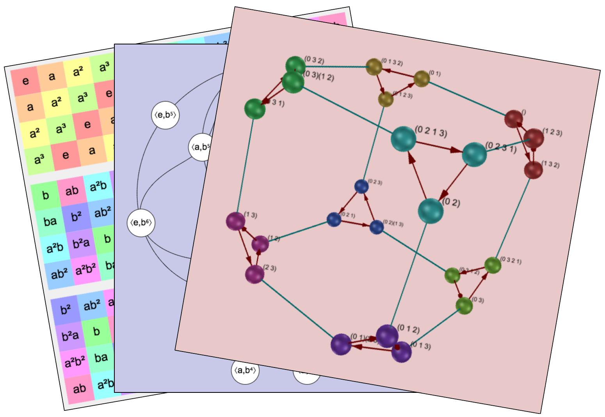

# Group Explorer 3.0

Group Explorer is visualization software for students and instructors of
abstract algebra, specifically group theory.  It has been around since 2005
as a desktop application, but was rewritten in 2019 as a web app.

## Status

**Beta:** We would appreciate any bug reports during summer 2019, so that we
can have a polished and reliable version ready for students in Fall 2019
courses.

[Try it live here here.](http://nathancarter.github.io/group-explorer/index.html)

## Contributors

 * Ray Ellis
    * developed most of the web version
 * Nathan Carter
    * developed the original version
    * added sheets and some miscellany to the web version

## License

[LGPL v3.0](https://www.gnu.org/licenses/lgpl-3.0.en.html)
