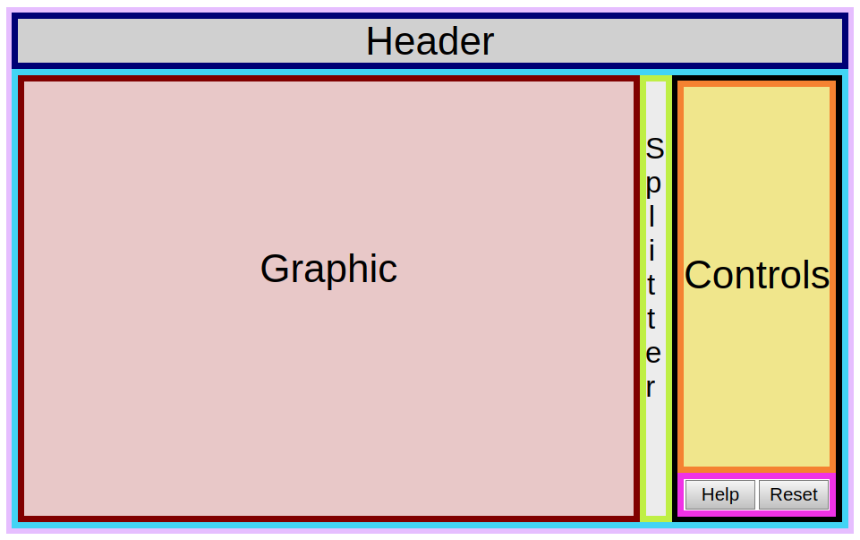
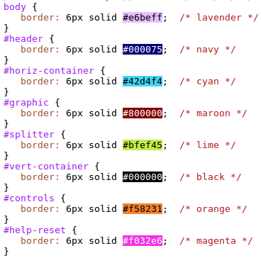

# Visualizer layout

## Top-level elements

The top-level visual components of the visualizers are
- **header**: a title showing the visualizer type and the group, such as "Cayley Diagram for <i>D</i><sub>4</sub>"
- **horiz-container**: a flex container to arrange the components of the visualizer other than the header
- **graphic**: the major component of the visualizer, a large graphic depicting the group according to the type of visualization
- **splitter**: a thin bar to the right of the graphic; grab the splitter with the mouse to resize the graphic
- **vert-container**: a flex container to arrange the controls and the help/reset buttons into a vertical stack
- **controls**: visualizer-specific panels that control the visualization, perhaps modifying their arrangement or highlighting a subset
- **help-reset**: buttons with the obvious functions

These visual components are outlined in the following HTML snippet, from [visualizer.html](../visualizerFramework/visualizer.html):

```html
<body class="vert">
   <div id="header" class="horiz">Header</div>
   <div id="horiz-container" class="horiz">
      <div id="graphic"></div>
      <div id="splitter"></div>
      <div id="vert-container" class="vert">
         <div id="control-placeholder"></div>
         <div id="help-reset" class="horiz">
            <button id="help">Help</button>
            <button id="reset">Reset</button>
         </div>
      </div>
   </div>
</body>
```
The `control-placeholder` element is replaced during initialization in by the visualizer-specific control panels in `VC.load()`([visualizer.js](../visualizerFramework/visualizer.js)). For a more complete example see the `load()` function in the [visualizerExemplar](./visualizerExemplar.html).

## Graphical layout
     
Visualizers all have the same basic graphical layout:

  

The elements may be identified in this diagram from their borders according to the following key:

  
  
## CSS

The following CSS (from [visualizer.css](../visualizerFramework/visualizer.css)) formats the elements and styles them to fit the page, as described in the embedded comments:

```css
/* causes web page to fill the window */
body {
   margin: 0;
   height: 100%;
   width: 100%;
}

/* provides a common button appearance across visualizers */
button {
   -webkit-appearance: none;
   background-color: #FFFFFF;
   border: 1px solid #A4A4A4;
   height: 30px;
   font-size: 14pt;
}
button:focus {
   outline: 0;
}

/* identifies vertical and horizontal flex containers */
.vert {
   display: flex;
   flex-direction: column;
}
.horiz {
   display: flex;
   flex-direction: row;
}

/* header format, like <H1> in a graphical context */
#header {
   background-color: #D0D0D0;
   justify-content: center;
   align-items: center;
   font-size: 40px;
   height: 60px;
   flex: 0 1 60px;
}

/* horizontal container for everything but the header; stretches to fill the height available */
#horiz-container {
   flex: 1 1 auto;
   height: 100%;
   xtouch-action: none;   /* for splitter */
}

/* container for main graphic, generally a <canvas>; flexes to fill the width available */
#graphic {
   flex: 1 1 auto;
   background-color: #F0F0F0;
   width: 100%;
}

/* grab here to resize graphic; changes cursor */
#splitter {
   flex: 0 0 auto;
   width: 8px;
   background: #ECECEC;
   cursor: col-resize;
}

/* container for arranging visualizer-specific controls and the help/reset buttons in vertical stack */
#vert-container {
   flex: 1 1 auto;
   width: 400px;
}

/* control panel style */
#control-options {
   background-color: #ECECEC;
   justify-content: center;
   height: 42px;
}
#control-options > button {
   min-width: 15%;
}

/* element stretches to fill vertical spaces, and adds scroll bar if needed */
.fill-vert {
   height: 100%;
   overflow: auto;
}

/* background for visualizer-specific controls */
.control {
   background-color: #E2E2E2;
}

/* style select pull-downs */
.select {
   height: 30px;
   font-size: 16px;
   width: 90%;
   margin: 0 5% 25px 5%;
}

/* container to hold help and reset buttons */
#help-reset {
   background-color: #ECECEC;
   justify-content: space-around;
   align-items: center;
   height: 44px;
}

/* styles help and reset buttons */
#help-reset > button {
   width: 48%;
   -webkit-appearance: none;
   background-image: linear-gradient(#F6F6F6, #C0C0C0);
   border: 1px solid #7E7E7E;
   height: 30px;
   font-size: 14pt;
}
```
