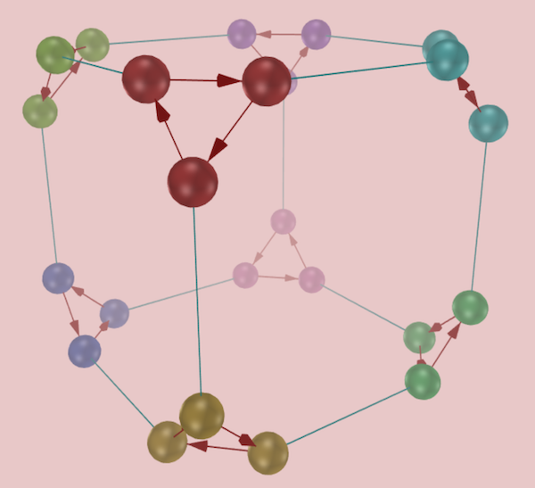

## Introduction to Cayley diagrams

The Cayley diagram is the clearest [visualizer](rf-geterms.md#visualizers)
for depicting groups as sets with structure.  They also clearly show the
group as acting on itself.
If you have not yet encountered the multiplication table
[visualizer](rf-geterms.md#visualizers), start with these help pages:

 * [The definition of a Cayley diagram](rf-groupterms.md#cayley-diagrams)
 * [The documentation on the Cayley diagram interface in
   *Group Explorer*](rf-um-cd-options.md)

CITE(VGT-2.4 MM-1.2 DE-3)

## What Cayley diagrams do well

The Cayley diagram is the only visualizer in Group Explorer with the
following two useful properties.

 * Each element in the group is represented by a unique item in the visualizer.
 * Full information about the group structure is immediately visible in the diagram.

[Cycle graphs](rf-groupterms.md#cycle-graph) also satisfy the first of these
requirements but not the second. [Multiplication
tables](rf-groupterms.md#multtable) satisfy the second but not the first.

Consider the Cayley diagram of
[\(S_3\)](http://nathancarter.github.io/group-explorer/GroupInfo.html?groupURL=groups/S_3.group)
shown below. There is a node in the diagram for each element of the group
and all information for determining the structure of the group can be
immediately seen (or sometimes inferred) from the arrows connecting the
nodes.

The fact that a red arrow goes from \(f\) to \(fr\) indicates that the red
arrows signify right-multiplication by the generator \(r\). So one can
see how two generators (the red arrows meaning \(r\) and the blue-green
arcs meaning \(f\)) combine to create all the structure of the group.
Following a red arrow and then a blue-green one will lead you to a different
location than following a blue-green arrow and then a red one; in this way
one can see that
[\(S_3\)](http://nathancarter.github.io/group-explorer/GroupInfo.html?groupURL=groups/S_3.group)
is not abelian.

Some groups in *Group Explorer* come with a human-designed Cayley diagram
that has a particular beauty or symmetry which best shows off the symmetry
inherent in the group.  Such diagrams are included if the standard
algorithms *Group Explorer* uses for auto-generating Cayley diagrams do not
yield aesthetically good results for that group.  Here are two particularly
pleasing Cayley diagrams.

## A Cayley diagram for the group [\(S_4\)](http://nathancarter.github.io/group-explorer/GroupInfo.html?groupURL=groups/S_4.group)

Node color is highlighted to indicate membership in cosets of the subgroup
\(\langle(1~2~3)\rangle\).

## A Cayley diagram for the group [\(A_5\)](http://nathancarter.github.io/group-explorer/GroupInfo.html?groupURL=groups/A_5.group)

Node color is highlighted to indicate membership in cosets of the subgroup
\(\langle(0~1~2~3~4)\rangle\).

There are some illustrations can be made from just about any kind of
visualization, including Cayley diagrams.  For instance, although this
[lattice of subgroups](s_3_multtable_lattice.png) and this
[short exact sequence of groups](s_3_multtable_ses.png) use multiplication
tables, they could just as easily have used Cayley diagrams instead.
In fact, you can ask *Group Explorer* to automatically generate such
visualizations for you; see the help on [sheets](rf-um-sheetwindow.md).
