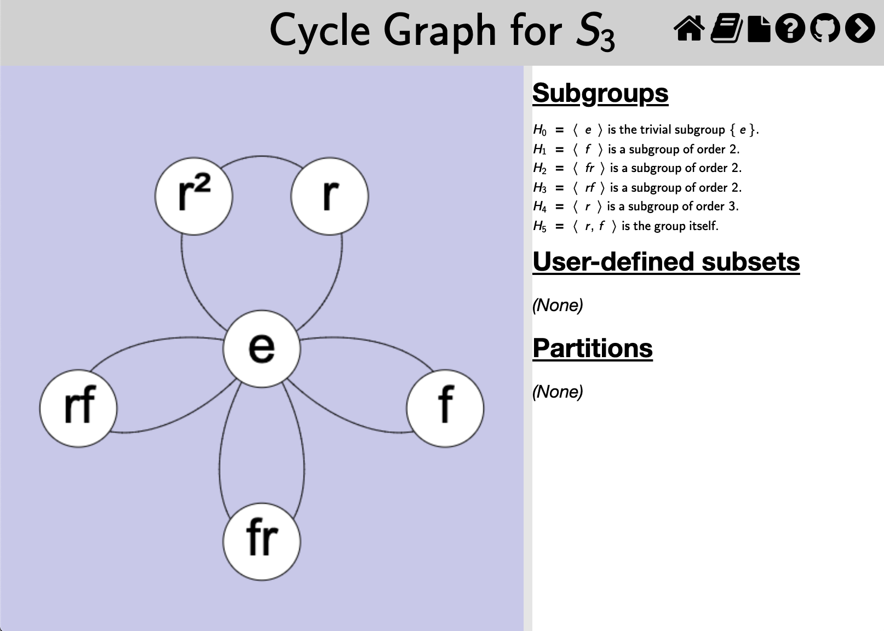

This page documents the interface for the large view of a [cycle
graph](rf-groupterms.md#cycle-graph). A cycle graph is one of
*Group Explorer's* four [visualizers](rf-geterms.md#visualizers), all of
which can appear either in [group info pages](rf-um-groupwindow.md),
[sheets](rf-geterms.md#sheets), or in their own pages. When they appear in
their own pages, this is refered to as a "large view," and you can read
about it in general [here](rf-um-largewindow.md). This page covers the
specifics for large views of cycle graphs.

## Magnification

You can move the cycle graph around by clicking it and dragging [two-finger drag];
you can zoom in and out of cycle graphs with your mouse wheel [pinch open/close].

The center of zooming is always the center of the view, so if you wish to
zoom around a different center, first click and drag to move that point to
the center of the view, then you can zoom in and out centered on that point.
[On a touch device just touch the screen with two fingers and simultaneously
drag and pinch to translate and magnify the graph with one gesture.]

To restore the default magnification level (which re-centers the graph and fits it
into the view), right-click anywhere in the cycle graph [control click on Mac,
two-finger tap on touch device].

## Related interfaces

The controls in the right side of the large window for cycle graphs are
described in [the help page for subset controls](rf-um-subsetlistbox.md).
