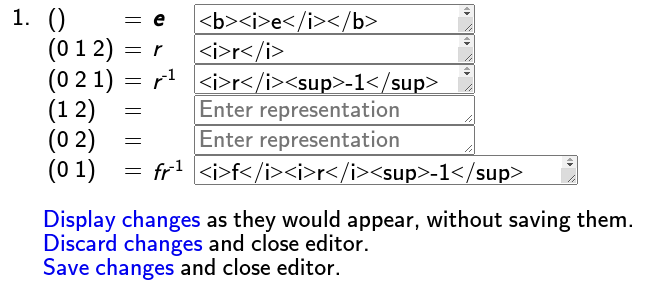

Group Info pages are the presentation to the user of all information *Group
Explorer* has about a given group. It may help you to open [an example group
info page
now](http://nathancarter.github.io/group-explorer/GroupInfo.html?groupURL=groups/Z_5.group)
and read it alongside this help page.

Let us consider each section that appears in a Group Info page separately.
(The header and footer of each Group Info page list these sections, as links
to help you navigate quickly within that page.)

## Facts

The basic facts about a group are its
[definition](rf-groupterms.md#gensrels), [order](rf-groupterms.md#order),
and any other names it has besides its primary name (which is the title of
each Group Info page).

## Views

*Group Explorer* is all about visualization. Thus the Views section receives
high priority, showing previews of every way to visualize a group,
including [Cayley diagrams](rf-groupterms.md#cayleydiagram), a
[multiplication table](rf-groupterms.md#multtable), a [cycle
graph](rf-groupterms.md#cyclegraph), and any [objects of
symmetry](rf-groupterms.md#symmetryobject) the group has.

## Description

Some (but not all) groups contain a description of the group, which appears
in this section.

## Computed properties

*Group Explorer* computes information about each group it loads. For
example, it computes all of its subgroups, which ones are normal,
information about conjugacy classes, and more. A summary of this
information appears in the Computed properties section of the Group Info
window, but **much** more information is available than it may seem from
the summaries. Users are encouraged to click the "tell me more" links which
appear in this section to find out reasons for the computations, and often
many additional helpful illustrations and computations.

## Other definitions

If the group can be [defined](rf-groupterms.md#gensrels) multiple ways, then
only the primary definition was listed in the Facts section (above), and all
other definitions appear here.

## Generators

Groups can be [generated](rf-groupterms.md#generators) in many ways and some
groups come with a few different commonly-used sets of generators chosen. If
the group has no pre-selected set of generators built in, *Group Explorer*
computes one such (minimum-size) set when the group is loaded. Each list of
generators is given in this section.

CITE(VGT-1.4 VGT-2.3)

## Naming schemes

The structure of a group is independent of whatever symbols we use to
represent the elements of the group. For this reason, a group may come with
several different lists of names for its elements, and the user may choose
any one of them to be used as the primary way of representing the elements
of the group. This section lets the user make such a selection and also
create new naming schemes.

This section also lets users remove or edit any of their previously-defined
naming schemes; this information is stored in the user's web browser so that
it will be preserved even when they leave the site.

The section contains a link that reads "Click here to add a new
[representation](rf-geterms.md#representation) for this group" and possibly
also links that read "Click here to edit this representation." (Note that
"[naming scheme](rf-geterms.md#namingscheme)" and
"[representation](rf-geterms.md#representation)" are interchangeable terms.)
In both cases, if you click the link, an interface like the following one
appears, allowing you to custom-define a naming scheme for the elements of
the group.

The left column lists the default element names, and you can click
entries in the right column and type any (plain) text you like. As you can
see in the image above, the user is typing the word "changing..." in the
top right cell of the table. When you are done, if you choose OK, your
changes will be committed and you will have defined a new representation (or
changed an old representation) of the elements of the group.

Links in the group info window to edit representations are present only for
representations that the user has created. Naming schemes built into the
group in *Group Explorer* are uneditable by the end user.

## Notes

Users can add their own personal notes to a group to supplement the default
information in any way they see fit. Such information appears in this
section, with controls for editing it. It is text only (not HTML) and will
be stored in the user's browser.
