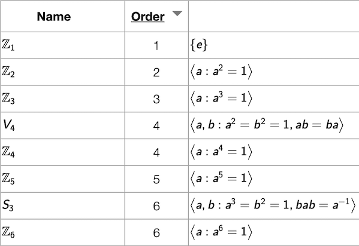

This page documents the main window of the *Group Explorer* web application
and from which all other page are opened.

## Data in the group table

Each row in the table shown in the main *Group Explorer* page represents a
group. By default, the following columns are visible (in this order) when
*Group Explorer* has opened:

1.  Name - the symbolic name of the group, as shown above
2.  [Order](rf-groupterms.md#order-of-a-group)
3.  [Definition](rf-groupterms.md#definition-of-a-group-via-generators-and-relations)
4.  [Cayley Diagram](rf-groupterms.md#cayley-diagrams)
5.  [Multiplication table](rf-groupterms.md#multiplication-table)
6.  [Object of symmetry](rf-groupterms.md#objects-of-symmetry)
7.  [Cycle graph](rf-groupterms.md#cycle-graph)

**To learn more about any group in the table, simply click its name. This
opens its [Group Info page](rf-um-groupwindow.md), which contains
everything *Group Explorer* knows about the group and is the launchpad for
exploring the group.** To ask for explanation about the contents of an
individual cell in the main group page, click the heading of that column,
which is a link to the help for that topic.

The first time you visit the *Group Explorer* main page, it may take some
time to load all the groups in the library.  Future times that you visit the
page, this should be faster, because the application stores some of the data
in your browser so that it can be accessed more quickly in the future.

## Sorting the table

You can sort the table by group name or order; simply click the column
heading cell.  (The heading for the Order column is also a link to the help
on group order; click outside the word "Order" to sort by that column.)

## Menu (top right)

The following icons appear on the top right of the main page.  Each is
addressed separately, below.

### Home

The first icon (the house) is a link to the main *Group Explorer* website.
That is, it will take you out of the app itself and back to the home page of
the entire project.

### Sheets

The second icon (the sheet of paper) takes you to a blank sheet, into which
you can insert visualizations of any groups from the library and connect
them with morphisms.  To read more on sheets, see [the sheets
tutorial](tu-sheets.md) or [the sheets reference](rf-um-sheetwindow.md).

### Help

The third icon (the question mark) takes you to the main page of these help
files.

### GitHub

The rightmost icon (the GitHub logo) takes you to [the source code
repository](https://github.com/nathancarter/group-explorer) from which the
application and its website were built.  Visit that site if you would like
to see how the application was built, make suggestions for its improvement,
report an error in the documentation, or get involved in improving the
software as a developer.
