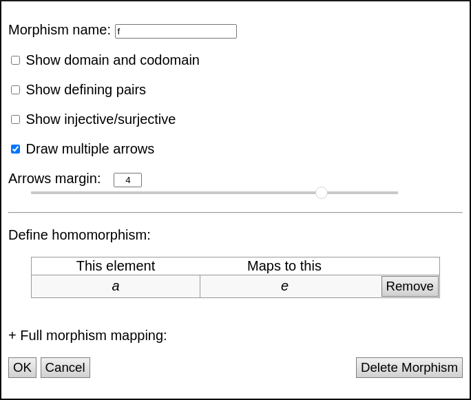
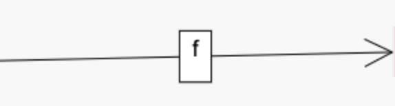
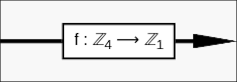
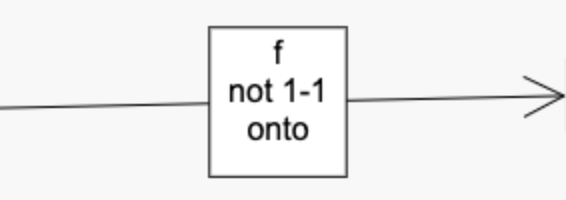

If you double-click on a [homomorphism](rf-groupterms.md#homomorphism) in a
[sheet](rf-geterms.md#sheets), you will be presented with the homomorphism
edit dialog, like the one shown below.

## Display of a homomorphism

The top of the homomorphism edit window allows you to customize the
appearance of the homomorphism as an object in a
[sheet](rf-geterms.md#sheets).

### Morphism name:

This is filled with some default text, which will be shown in a small
rectangular label on the morphism arrow in the sheet, as shown below.

### Show domain and codomain

If the checkbox beneath it, "Show domain and codomain," is checked, then the
label will be slightly larger, including the specified information, as shown
below.

### Show defining pairs

This box is not checked by default, but when checked, it augments the label
with a list of all generating pairs, as in the "Mapping" portion of the
dialog, discussed [below](#pairs-in-the-map). See the example below.

### Show injective/surjective

This box is not checked by default, but when checked, it augments the label as follows:

 * If the homomorphism is
   [injective](rf-groupterms.md#injective-injection),
   then the phrase "1-1" is added
   (because "one-to-one" is a shorthand for "injective").
   Otherwise, the phrase "not 1-1" is added.
 * If the homomorphism is
   [surjective](rf-groupterms.md#surjective-surjection),
   then the phrase "onto" is added
   (because "onto" is a shorthand for "surjective").
   Otherwise, the phrase "not onto" is added.

Two of these phrases appear in the example shown below.

### Draw multiple arrows

This box is not checked by default, but when checked, it replaces the single
arrow of the morphism with several arrows, one for each element of the
domain. The source of these arrows is dependent on the visualizer; for
instance, in the multiplication table below, the left column of the
multiplication table is used. The endpoint of the arrows is determined by
the map; in the example below, the map \(z\) is the zero map, mapping all
elements to the identity.

## Mathematical definition of the homomorphism

The bottom half of the homomorphism edit window allows you to specify the
homomorphism as a function, a map from one group to another.

### Pairs in the map

Under the heading "Define the homomorphism here," we have a table listing
which elements of the homomorphism's domain map to which elements of its
codomain.  Each row of the table is a pair of elements, call them \(d\) from
the domain and \(c\) from the codomain, that have been added to the
homomorphism already, meaning that the user has stipulated that \(f(d)=c\)
(if the morphism is named \(f\)).

Next to each pair in the map appears a "Remove" button so that if you wish
to edit the morphism by mapping \(d\) to a different element, you can remove
the pair \((d,c)\) from the map and then assign \(d\) a new image, as
documented below.

The user assigns a pairing \((d,c)\) by selecting \(d\) from the domain
drop-down list beneath the table and \(c\) from the codomain list, then
clicking the "Add:" button.  Because of the way the drop-down lists are
arranged, they will read like the equation \(f(d)=c\) before you click
"Add," to ensure that you're adding the pair you intend.

The domain drop-down list contains only elements whose image has not already
been determined by the pairs that have been added to the map.  For instance,
if you have already placed \((a_1,b_1)\) and \((a_2,b_2)\) into the map,
then by the properties of homomorphisms, the image of all elements of the
subgroup \(\langle a_1,a_2 \rangle\) have been determined.  Thus none of
those elements will show up in the domain drop-down list, because none are
assignable any longer.

When the domain elements of the pairs in the map don't generate the entire
domain, *Group Explorer* searches for any homomorphism extending the pairs
in the table and uses that.  You can click the "Preview" button to see
exactly which homomorphism was chosen, or simply add pairs to the map to
specify exactly the one you want.

The codomain drop-down list contains only elements that could legitimately
be the image of the element chosen in the domain drop-down list.  By "could
legitimately be the image," I mean that there exists some homomorphism that
contains the pairs already added to the map plus the new pair you might add.
Thus this constraint ensures that you can use the editor to define only
homomorphisms, not any other kind of function between groups.

### Other buttons

The OK button saves your changes to the morphism and closes the dialog.

The Cancel button closes the dialog without saving your changes into the
sheet.
