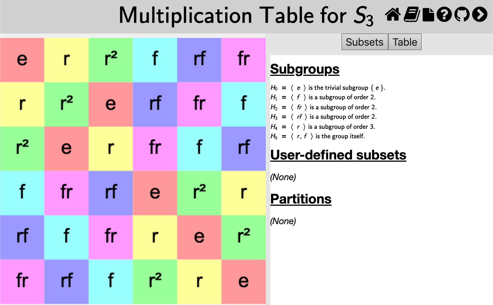
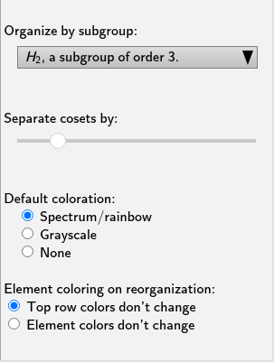
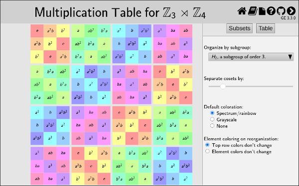

This page documents the interface for the large view of a [multiplication
table](rf-groupterms.md#multiplication-table). A multiplication table is one
of *Group Explorer's* four [visualizers](rf-geterms.md#visualizers), all of
which can appear either in [group info pages](rf-um-groupwindow.md),
[sheets](rf-geterms.md#sheets), or in their own pages. When they appear in
their own pages, this is refered to as a "large view," and you can read
about it in general [here](rf-um-largewindow.md). This page covers the
specifics for large views of multiplication tables.

## Reordering header row or header column

You can choose the order of elements along the top row (or left column) of
the multiplication table using your mouse. (Note that order of elements in
the top row and left column determine the contents of the rest of the table.
*Group Explorer* fills it out using the group operation.)

To move an element from one point to another in the top row, shift-click [tap-hold]
on the element's cell in the table and drag [one-finger drag] it to the new position
(left or right in the top row). To move an element in the left column, the
procedure is the same, except vertical. Note that the top row and left
column will stay synchronized, so no matter which one you reorder, both will
change.

You can also ask *Group Explorer* to organize the top row/left column of the
table according to a particular subgroup and its cosets; [see
below](#organization-by-subgroup).

## Magnification

You can move the multiplication table around by clicking it and dragging [two-finger drag];
you can zoom in and out with your mouse wheel [pinch open/close].

The center of zooming is always the center of the view, so if you wish to
zoom around a different center, first click and drag to move that point to
the center of the view, then you can zoom in and out centered on that point.
[On a touch device just touch the screen with two fingers and simultaneously
drag and pinch to translate and magnify the table with one gesture.]

To restore the default magnification level (which re-centers the table and fits it
into the view), right-click anywhere in the table [control click on Mac,
two-finger tap on touch device].

## The Table tab

The controls panel for multiplication table large views has two tabs at the
top: Subsets and Table. The first of these allows you to highlight subsets
of the group in the table; [see below for information on that
tab](#related-interfaces). The second of these allows you to change the
structure or appearance of the table in other ways. This section describes
those controls.

### Organization by subgroup

By default, the "Organize by subgroup:" drop-down list at the top of the
Table tab has "none" selected. However, if you wish to organize the top row
(and left column) of the multiplication table so that a particular subgroup
is at the left (top) and its cosets follow it one after the other, you can
choose that subgroup from this drop-down list.

You can also choose the exact order of the elements in the top row or left
column of the table manually; [see
above](#reordering-header-row-or-header-column).

### Separation of cosets

If you have made a selection on the "Organize by subgroup:" drop-down list
([see above](#organization-by-subgroup)), then *Group Explorer* also enables
you to put some vertical and horizontal space between the cosets in the
multiplication table, to help the viewer visually separate them. The slider
under the "Separate cosets by:" header determines how much space (the
leftmost extreme is zero, no space, the default).

This is especially useful when the subgroup in question is normal, because
it helps visualize the quotient group. As an example, consider [this
multiplication table](d_4_multtable_organized.png) illustrating the quotient
of \(D_4\) by \(\mathbb{Z}_2\).

CITE(VGT-7.3 MM-3.5 DE-8.2)

### Colorization scheme

There are three colorization schemes for multiplication tables:

*   Spectrum/rainbow
*   Grayscale
*   None

The first is the default, and makes multiplication tables use all the hues
in the color spectrum, as in the first illustration on this page. Grayscale
is appropriate if you intend to print on a black-and-white printer; the
colors of gray contrast better than the rainbow hues, which all have the
same saturation and intensity. Choosing None makes the multiplication table
just black text on white background.

Note that the colorization scheme you choose is overridden by any
highlighting you do on the Subsets tab, documented on a separate page, as
indicated below.

### Element recoloring on reorganization

When you change the rows and columns of the multiplication table, either by
dragging one of the rows/columns to a new location or by organizing the table by a
different subgroup, the colors of the cells change, too. *Group Explorer* does
this in a couple of different ways: it can keep the the top row (and left-most
column) colors as they are, updating only the labels to reflect the reorganization;
or it can keep the color currently associated with each label, changing the
coloring of the top row as the labels are rearranged. (In either case this
determines the contents and coloring of the rest of the table, as described
[above](#reordering-header-row-or-header-column).)

The first approach, keeping the top row colors intact, generally makes it easier
to spot large patterns in the multiplication table through their similar
hue. For example, in the following image of the \(\mathbb{Z}_3 \rtimes
\mathbb{Z}_4\) multiplication table organized by the \(H_2\) subgroup, it is
easy to recognize the orange and yellow colors of the upper left-hand corner
subgroup in blocks on the bottom and right, indicating that \(H_2\) is a normal
subgroup. On the other hand, keeping the element colors unchanged makes it
easier to follow the action of a particular element as the table is reorganized.
Try them both!

## Related interfaces

The controls in the Subsets tab on the right side of the large window for
multiplication tables are described in [the help page for subset
controls](rf-um-subsetlistbox.md).
