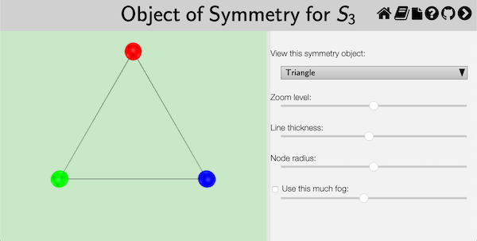
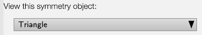

This page documents the interface for the large view of an [object of
symmetry](rf-groupterms.md#objects-of-symmetry). An object of symmetry is
one of *Group Explorer's* four [visualizers](rf-geterms.md#visualizers), all
of which can appear either in [group info pages](rf-um-groupwindow.md),
[sheets](rf-geterms.md#sheets), or in their own pages. When they appear in
their own pages, this is refered to as a "large view," and you can read
about it in general [here](rf-um-largewindow.md). This page covers the
specifics for large views of objects of symmetry.

## Viewing the object

A symmetry object (unlike multiplication tables and cycle graphs) is a
three-dimensional structure. Thus you can click and drag [one-finger drag]
on the view to rotate it in three-dimensional space; you can right-click and
drag [two-finger drag] to translate it; and you can use the mouse wheel [pinch 
open/close] to zoom in and out. This lets you see all sides of the
object, and seeing it in motion can give you a better mental picture of it.

## Choosing which object to view

Some groups have more than one object of symmetry defined for them. For this
reason, the topmost portion of the control pane on the right side of a large
view for symmetry objecst allows you to choose which of the symmetry objects
you wish to view. You choose from a list, as shown in the picture below.

In this illustration, the triangle is selected, but the user can click on it
to open a list. Some groups only have one symmetry object on this list, but
others have several. Choosing one changes the view immediately.

## Related interfaces

The remainder of the controls in the right side of the large window for
symmetry objects are described in [the help page for three-dimensional
controls](rf-um-modelview.md).
