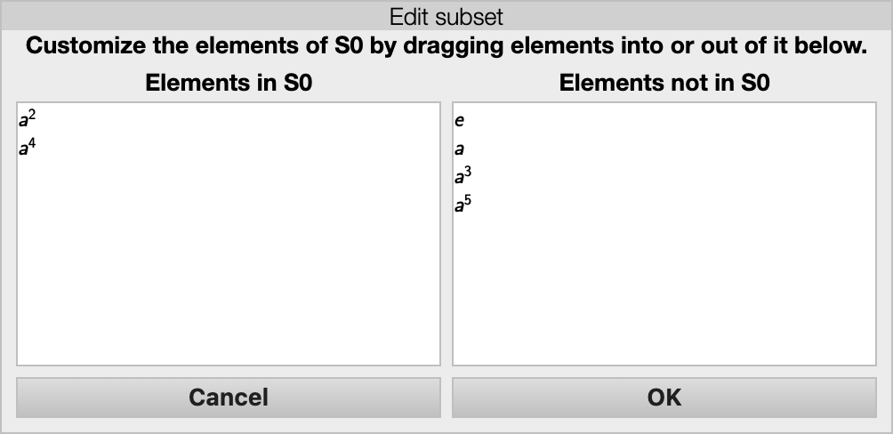

Every [visualizer](rf-geterms.md#visualizers) in *Group Explorer* except
[objects of symmetry](rf-groupterms.md#objects-of-symmetry) have a panel
like the one shown below for examining subgroups of the group under study.

The particular subsets panel shown above is for [the eight-element
quaternion
group](http://nathancarter.github.io/group-explorer/GroupInfo.html?groupURL=groups/Q_4.group).

## Tour of the subsets pane

The topmost portion of the interface lists all the subgroups of the group
shown in the main portion of the view, beginning with \(H_0\), the trivial
(one-element) subgroup, and ending with \(H_n\), the whole group, for a
group with \(n+1\) subgroups. *Group Explorer* computes all subgroups of
each group when loading it; the user cannot add or remove any entries from
this section.

The next portion of the window lists user-defined subsets, which is empty by
default. You can add and delete subsets relevant to your study of the group;
[see below](#topmost-items-on-the-menu).

The last portion of the window lists partitions of the group (e.g. conjugacy
classes, cosets of a particular subgroup, etc.) and is particularly useful
for creating informative highlightings of the visualizer. Partitions can be
added to this section via various computations; [see
below](#the-compute-submenu).

The subsets panel allows computations and highlighting with respect to both
subsets and subgroups of whatever group is being visualized. It has many
features, covered one at a time below.

For any subset listed in the pane, you can find out its list of elements by
double-clicking the subset you're interested in.

Right-clicking on the subsets pane brings up a menu from which you can take
several important actions, some of which are visible in the following
screenshot.

Creating and deleting user-defined subgroups are both possible using this
menu, as well as several types of computation and highlighing. Here follows
the documentation for each option on this menu.

## Topmost items on the popup menu

### Edit list of elements in \(S_i\)

This menu item appears only if you right-clicked on a user-defined subset.
If you choose it, a window like the one pictured here opens.

The left pane shows the elements in your subset and the right pane shows the
other elements of the group. To add elements to your subset, drag them in
from right to left. Dragging from the left pane to the right pane takes
elements out of your subset. OK approves your changes and Cancel discards
them.

### Delete \(S_i\)

This menu item appears only if you right-clicked on a user-defined subset.
Choosing it deletes the user-defined subset on which you right-clicked.

### Delete \(CC_i\), \(OC_i\), \(gH_i\), etc.

This menu item appears only if you right-clicked on a partition (i.e. on one
of its sets). Partitions can be conjugacy classes \(CC_i\), order classes
\(OC_i\), left cosets \(gH_i\), or right cosets \(H_ig\). Choosing this
option deletes the entire partition on which you right-clicked (e.g. all
conjugacy classes, all order classes, or all left/right cosets of the
subgroup, etc.).

### Create \(S_i\)

This menu item creates a new subset under the "User-defined subsets"
heading. The subset will be empty, and you can [add elements to it as
described above](#topmost-items-on-the-menu).

## The Compute &gt; submenu

### Compute &gt; all conjugacy classes \(CC_i\)

This submenu item appears only if you have not already asked *Group
Explorer* to perform this computation. It adds the set of [conjugacy
classes](rf-groupterms.md#conjugacy-classes) as a new partition under the
"Partitions" heading.

### Compute &gt; all order classes \(OC_i\)

This submenu item appears only if you have not already asked *Group
Explorer* to perform this computation. It adds the set of [order
classes](rf-groupterms.md#order-classes) as a new partition under the
"Partitions" heading.

### Compute &gt; normalizer of \(X\), \(\text{Norm}(X)\)

This submenu item appears when you right-click on the subset \(X\), but only
if you have not already asked *Group Explorer* to perform this computation.
It adds the [normalizer](rf-groupterms.md#normalizer-of-a-subgroupsubset) of
the given subset to the list of user-defined subsets.

Note that whenever you add a new subset, *Group Explorer* always checks
whether it exists under another name, and gives you the option to cancel
your addition if so.

### Compute &gt; closure of \(X\), \(\langle X \rangle\)

This submenu item appears when you right-click on the subset \(X\), but only
if the subset on which you right-clicked is not a subgroup. It adds the
[closure](rf-groupterms.md#closure-of-a-subset) of the given subset to the
list of user-defined subsets.

Note that whenever you add a new subset, *Group Explorer* always checks
whether it exists under another name, and gives you the option to cancel
your addition if so.

### Compute &gt; left cosets \(g_iH\)

This submenu item appears when you right-click on the subset \(X\), but only
if you have not already asked *Group Explorer* to perform this computation,
and the subset on which you right-clicked is a subgroup. It adds the set of
left [cosets](rf-groupterms.md#cosets) as a new partition under the
"Partitions" heading.

### Compute &gt; right cosets \(Hg_i\)

This submenu item appears when you right-click on the subset \(X\), but only
if you have not already asked *Group Explorer* to perform this computation,
and the subset on which you right-clicked is a subgroup. It adds the set of
right [cosets](rf-groupterms.md#cosets) as a new partition under the
"Partitions" heading.

### Compute &gt; an intersection &gt; subsubmenu

This submenu appears when you right-click no the subset \(X\), and it
contains items allowing you to perform an intersection of \(X\) with any
other subset listed in the whole pane, provided that you have not already
requested such a computation. Choosing one of the items on this submenu
computes the intersection described in that item, e.g. "the intersection of
\(H_2\) with \(S_5\)." Intersection here means simply what it does in set
theory--the elements in common between the two sets.

Note that whenever you add a new subset, *Group Explorer* always checks
whether it exists under another name, and gives you the option to cancel
your addition if so.

### Compute &gt; a union &gt; subsubmenu

This submenu appears when you right-click no the subset \(X\), and it
contains items allowing you to perform a union of \(X\) with any other
subset listed in the whole pane, provided that you have not already
requested such a computation. Choosing one of the items on this submenu
computes the union described in that item, e.g. "the union of \(H_2\) with
\(S_5\)." Union here means simply what it does in set theory--the combined
elements from the two sets.

Note that whenever you add a new subset, *Group Explorer* always checks
whether it exists under another name, and gives you the option to cancel
your addition if so.

### Compute &gt; an elementwise product &gt; subsubmenu

This submenu appears when you right-click no the subset \(X\), and it
contains items allowing you to perform an [elementwise
product](rf-groupterms.md#elementwise-product) of \(X\) with any other
subset listed in the whole pane, provided that you have not already
requested such a computation. Choosing one of the items on this submenu
computes the elementwise product described in that item, e.g. "the
elementwise product of \(H_2\) with \(S_5\)."

Note that whenever you add a new subset, *Group Explorer* always checks
whether it exists under another name, and gives you the option to cancel
your addition if so.

<!-- removing help on morphisms section because it hasn't been built yet

## The Morphisms &gt; submenu

The morphism submenu appears only if the large visualizer containing the
subset pane is connected to a small visualizer appearing in a sheet, and
that small visualizer has one or more morphisms for which it is either the
domain or codomain.

### Push \(X\) through \(f\) into \(G\), giving \(f[X]\)

A submenu item of this form appears for every morphism \(f\) whose domain is
the small visualizer associated with the large visualizer containing this
subset pane. Choosing it causes *Group Explorer* to compute the
[image](rf-groupterms.md#image-of-a-subset-under-a-morphism) of \(X\) under
\(f\) and to add that subset to the subset pane for the codomain visualizer.

Note: The codomain is a different visualizer, so you will see no change in
the subsets pane you right-clicked; you will need to open the other
visualizer to see the new subset you created.

Note that whenever you add a new subset, *Group Explorer* always checks
whether it exists under another name, and gives you the option to cancel
your addition if so. This holds true even in this case, when you may not be
looking at the pane into which the new subset is being introduced.

### Pull \(X\) back through \(f\) into \(G\), giving \(f^{-1}[X]\)

A submenu item of this form appears for every morphism \(f\) whose codomain
is the small visualizer associated with the large visualizer containing this
subset pane. Choosing it causes *Group Explorer* to compute the
[preimage](rf-groupterms.md#preimage-of-a-subset-under-a-morphism) of \(X\)
under \(f\), and to add that subset to the subset pane for the domain
visualizer.

Note: The domain is a different visualizer, so you will see no change in the
subsets pane you right-clicked; you will need to open the other visualizer
to see the new subset you created.

Note that whenever you add a new subset, *Group Explorer* always checks
whether it exists under another name, and gives you the option to cancel
your addition if so. This holds true even in this case, when you may not be
looking at the pane into which the new subset is being introduced.

-->

## Highlight subset by &gt; submenu

This submenu appears only if you click on a subset (as opposed to a
heading). Its items depend on the visualizer as follows.

*   For Cayley diagrams, highlighting options are  
    
    Node color,  
    
    Ring around node, and  
    
    Square around node.  

*   For multiplication tables, highlighting options are  
    
    Background,  
     Border, and  
     Corner.  

*   For cycle graphs, highlighting options are  
    
    Background,  
     Border, and  
     Top.

Choosing one causes the subset on which you right-clicked to be highlighted
in the visualizer (both its large and small incarnations) with the method
you selected. For instance, here is a multiplication table with an order-4
subgroup highlighted according to corners.

Note that this undoes any other highlighting of the type in question (e.g.
former "Node color" highlighting will evaporate when new "Node color"
highlighting is chosen).

Note further that in multiplication tables, highlighting items by background
highlighting removes the default coloration scheme (e.g. rainbow,
grayscale).

You can undo this highlighting using the "Clear all highlighting" option on
this same menu ([see below](#clear-all-highlighting)).

## Highlight partition by &gt; submenu

This submenu appears only if you click on a partition (i.e. on one of its
sets). Its items depend on the visualizer in the same way [described
above](#highlight-subset-by-submenu).

Choosing one of its items causes the partition on which you right-clicked to
be highlighted in the visualizer (both its large and small incarnations)
with the method you selected, using a different color for each set in the
partition. For instance, here is a cycle graph with the conjugacy class
partition highlighted according to background.

Note that this undoes any other highlighting of the type in question (e.g.
former "Node color" highlighting will evaporate when new "Node color"
highlighting is chosen).

Note further that in multiplication tables, highlighting items by background
highlighting removes the default coloration scheme (e.g. rainbow,
grayscale).

You can undo this highlighting using the "Clear all highlighting" option
documented immediately below.

## Clear all highlighting

Removes all highlighting of any type from the visualizer. (Types are listed
[above](#highlight-subset-by-submenu).)
