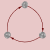
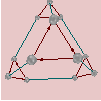
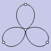
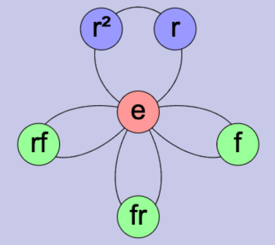
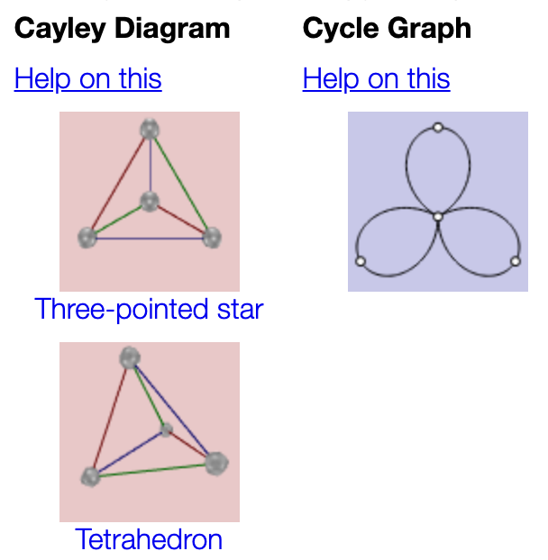

## First Tutorial

Welcome to the first *Group Explorer* tutorial! This first tutorial is
designed to give you both motive and opportunity to begin your own
explorations. We start with a tour of the major visuals *Group Explorer*
offers and then have a description of the most useful features.

This page is meant to be a springboard, so don't hesitate to follow any of
the (many) links below, even if you haven't read this whole page. That's the
point of this tutorial--to help you start to explore.

## Pictures

*Group Explorer* gives four ways to answer the question "What does a group
look like?"  This is its primary aim and the reason for its creation.

The multiplication table is the simplest way to picture a group, and
explicitly shows *the group operation.*

&nbsp; &nbsp; &nbsp;

 * [Definition of a multiplication table](rf-groupterms.md#multiplication-table)
 * [Introduction to multiplication tables](gs-mt-intro.md) (Getting Started pages)
 * [Basic manipulations of a multiplication table](tu-mt-manip.md) (Tutorial)
 * [Complete information about the multiplication table interface](rf-um-mt-options.md) (User Manual)

CITE(VGT-4.3 MM-1.5 DE-5.3)

Groups describe symmetry, sometimes the symmetry of three-dimensional
objects.  Thus these objects have *the symmetry the group describes.*

&nbsp; &nbsp; &nbsp;

 * [Definition of an object of symmetry](rf-groupterms.md#objects-of-symmetry)
 * [Complete information about the object of symmetry interface](rf-um-os-options.md) (User Manual)

CITE(VGT-3 MM-1.3 TJ-12.2)

Cayley diagrams show the group as a graph of elements interacting with each
other.  They show the group's *structure* very well, exemplifying Cayley's
theorem by showing *how the group acts on itself.*

&nbsp; &nbsp; &nbsp;

 * [Definition of a Cayley diagram](rf-groupterms.md#cayley-diagrams)
 * [Introduction to Cayley diagrams](gs-cd-intro.md) (Getting Started pages)
 * [Basic manipulations of a Cayley diagram](tu-cd-manip.md) (Tutorial)
 * [Complete information about the Cayley diagram interfacel](rf-um-cd-options.md) (User Manual)

CITE(VGT-2.4 MM-1.2 DE-3)

Cycle graphs show an important relationship among the elements of the group
by exhibiting *the group's orbits.*

&nbsp; &nbsp; &nbsp;

 * [Definition of a cycle graph](rf-groupterms.md#cycle-graph)
 * [Complete information about the cycle graph interface](rf-um-cg-options.md) (User Manual)

CITE(VGT-5.1)

## Features

Here are some of hte most important things not to miss about how *Group
Explorer* makes gropu theory more accessible and intuitive.

### Each picture of a group is very interactive

[Study](tu-discovery.md) properties of the group by reorganizing a diagram
or [highlighting it in different ways](rf-um-subsetlistbox.md#highlight-subset-by-submenu).  Save useful
views as images to use in a document, email, or website.

### *Group Explorer* has a large library of groups

[The main page of the
application](http://nathancarter.github.io/group-explorer/GroupExplorer.html)
is a list of groups known to the software.  It is very handy for learning by
example, for testing conjectures, and getting one's hands dirty in the real
subject matter of group theory.  Each group in the library, when clicked,
opens a [group info window](rf-um-groupwindow.md) full of useful information
about the group.

### Help links appear in many locations

Many portions of the software contain links to useful explanations.  In
addition to the help pages you're reading now, [group info
windows](rf-um-groupwindow.md) may contain links to the help documentation
or to dynamic generations of illustrations of various concepts.  Also, each
[visualizer](rf-geterms.md#visualizers) has a [help
button](rf-um-largewindow.md#help) to take you directly to the help for that
visualizer.

### Groups can be connected and compared

You need not be content with examining groups in isolation.
[Sheets](tu-sheets.md) are an important tool that lets you create
[homomorphisms](rf-um-morphedit.md) between groups, see complex diagrams
like subgroup lattices, and more.
