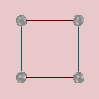
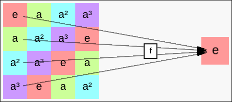

# List of Tutorials

The following tutorials will help you get to know *Group Explorer* by
walking through some of the most important and commonly used features.

 * [Starting Exploring](tu-first.md)

 * [Manipulating Cayley Diagrams](tu-cd-manip.md)

    

 * [Manipulating Multiplication Tables](tu-mt-manip.md)

    

 * [Introduction to Sheets](tu-sheets.md)

    

 * [Beginning Mathematical Discovery](tu-discovery.md)
