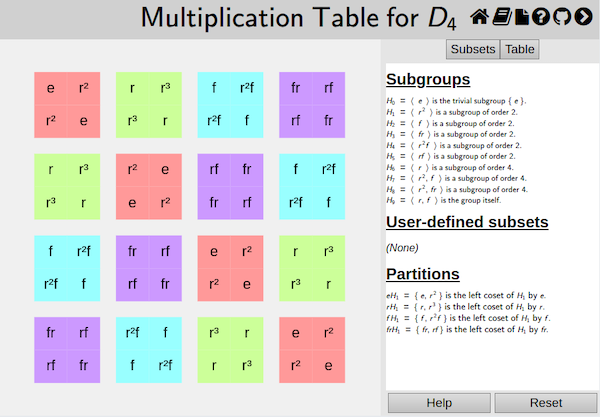

## Manipulating Multiplication Tables

Multiplication tables are the simplest and most common of the
[visualizers](rf-geterms.md#visualizers) *Group Explorer* provides viewing
groups. Here we will concentrate on the basic manipulations you might want
to perform on a group's multiplication table as you investigate that group.

For more introductory information on multiplication tables, refer to [the
definition of a multiplication table](rf-groupterms.md#multtable) or [a
quick introduction to multiplication tables](gs-mt-intro.md). For more
complete information on the multiplication table interface, refer to [the
relevant section of the user manual](rf-um-mt-options.md).

## Zooming

**Use your mouse scroll wheel or a pinch gesture to zoom in and out.**

If a group is very large, you may want to view its multiplication table
shrunk to the point where you can see it comfortably on screen. Conversely,
if a group is very small, you may want to blow up the multiplication table.

## Organizing

The order of elements across the top and down the left side of a
multiplication table is chosen by *Group Explorer* to be somewhat natural.
But if you would prefer a different order, **hold the Shift key while you
click and drag on a (non-identity) element** in either the top row or left
column and drop it where you want it. The table will change when you drop
it.

You can also reorganize the table according to subgroups by using the
drop-down list on the Table tab of the controls. For full documentation on
the Table tab, refer to [the relevant section of the user
manual](rf-um-mt-options.md).

## Highlighting

You can highlight the multiplication table according to various properties
of the group elements. This can be useful for studying different properties
of the group. **Right-click on various subsets in the Subsets tab of the
controls and choose from among the highlighting options** -- background
,
border , and
corner .

The example below highlights each conjugacy class a different color, thereby
exhibiting a class equation visually.

For fuller documentation on the Subsets tab, refer to [the relevant section
of the user manual](rf-um-subsetlistbox.md).

## Cosets

It is particularly useful to combine both the organization and highlighting
of a multiplication table together (and use the cosets separation option on
the Table tab) to create diagrams like the one shown below, which illustrate
[quotient groups](rf-groupterms.md#quotient-group).

